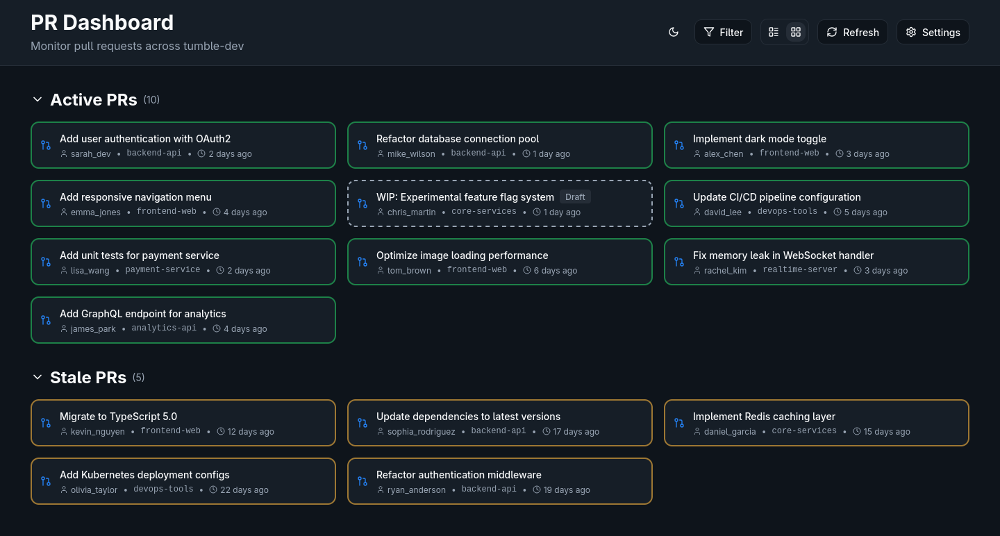
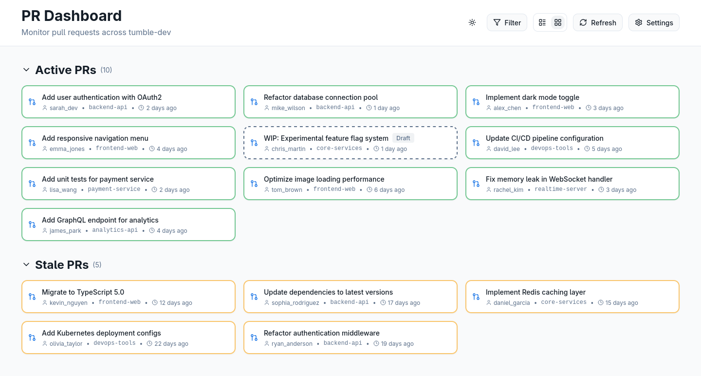

# Introduction

This is a neat GitHub PR Dashboard that is easy to use and looks great. Just put in the name of your organization in the settings together with a GitHub token that has `read` and `read:org` permissions, and it will work out of the box.

# Functionality

The dashboard can be viewed in either a grid view or a list view, you can toggle between light and dark mode, and filter out any repos in your organization that you are not interested in seeing the status of PR's.

